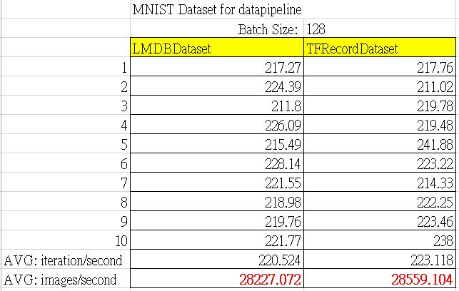

# Explanation

### What are these new files for?

The new python files are to measure the performance of my developed LMDBDataset API and the original TFRecordDataset API.
The implemenation of LMDBDataset in TensorFlow is here: https://github.com/teyenliu/tensorflow/commit/a706c73130fc258c86861623b2302806f2fa4bf2

**convert_to_records_lmdb.py**: This python file is to convert MNIST data format into lmdb,  
which yields `datapoints`.

**fully_connected_reader_lmdb.py**: This python file is to train a fully connected neural net with MNIST data in lmdb,  
which contains a new argument `perf` to only measure the performance of input data pipeline.

****Example 1****: to train on MNIST dataset, you may give the following command:
````shell
$ python fully_connected_reader_lmdb.py --train_dir ./lmdb_data --num_epochs 10 --batch_size 128 --perf training
````
****Example 2****: to check the performance of data pipeline on MNIST dataset, you may give the following command:
````shell
$ python fully_connected_reader_lmdb.py --train_dir ./lmdb_data --num_epochs 10 --batch_size 128 --perf datapipeline
````

### The performance result
The performance result shows that LMDBDataset and TFRecordDataset APIs have almost the same performance speed to read data.


